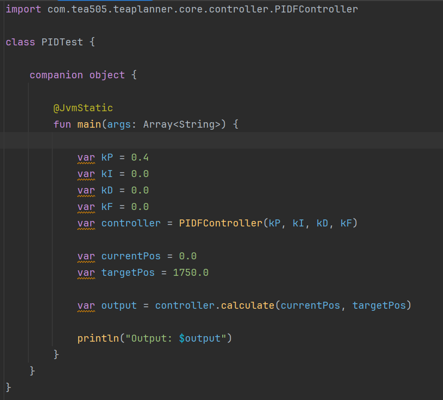
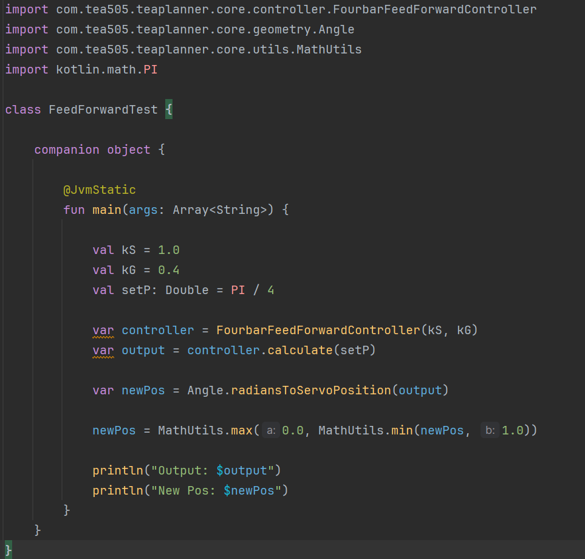
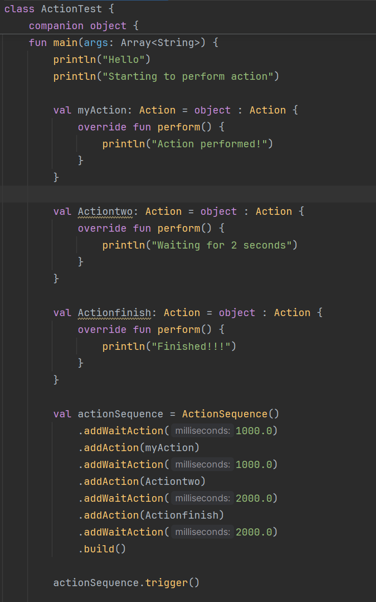
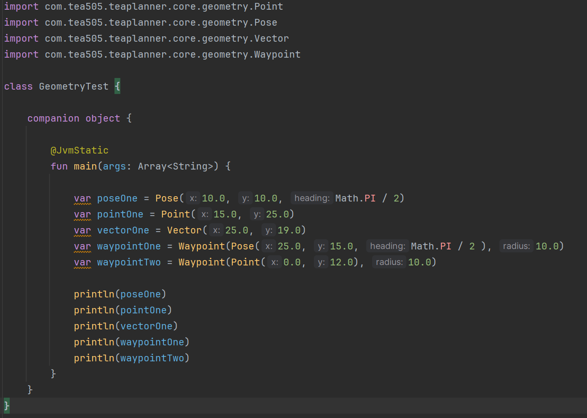
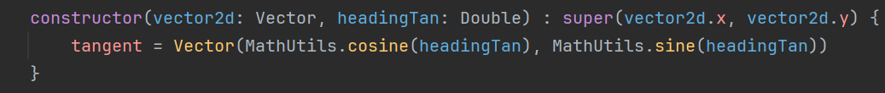

# Breakdown

### Controller
Controller consists of a PIDF Loop controller that implements proportional, integral, derivative and feedforward gains to help improve a mechanism's accuracy.

* **This is an example of how you can use a PIDFController.**

* **This is an example of how you can use a FourBarFeedForwardController**

### Event
This is where Actions and Action sequences take place. This helps build and perform a sequence of actions through a runnable and thread.

* **This is an example of how you can use Actions and Sequences.**

### Geometry
The Geometry folder provides various geometric utilities and structures used throughout the system.

* **This is an example of how you can create constructors for different geometric variables.**

### Kinematics
The Kinematics module deals with the movement and dynamics of mechanisms.

### Localization
The Localization module handles the determination of the mechanism's position and orientation.

### Profile
The Profile module involves creating and managing motion profiles for smooth and efficient movement.

### Utils
The Utils module consists of utility classes that simplify basic functions, such as performing basic mathematical operations.

* **An example of how utility classes can be used:**

